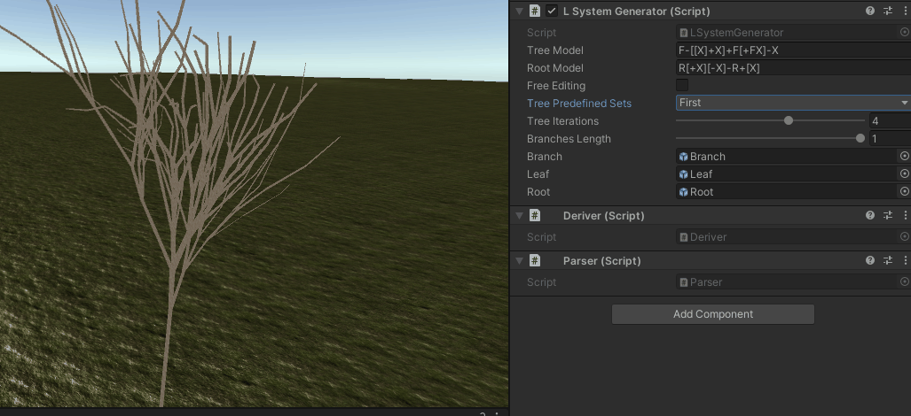
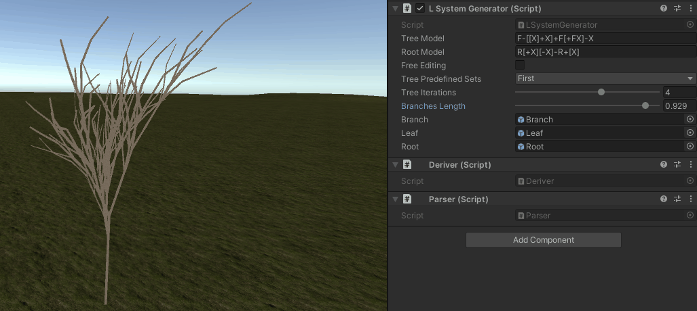
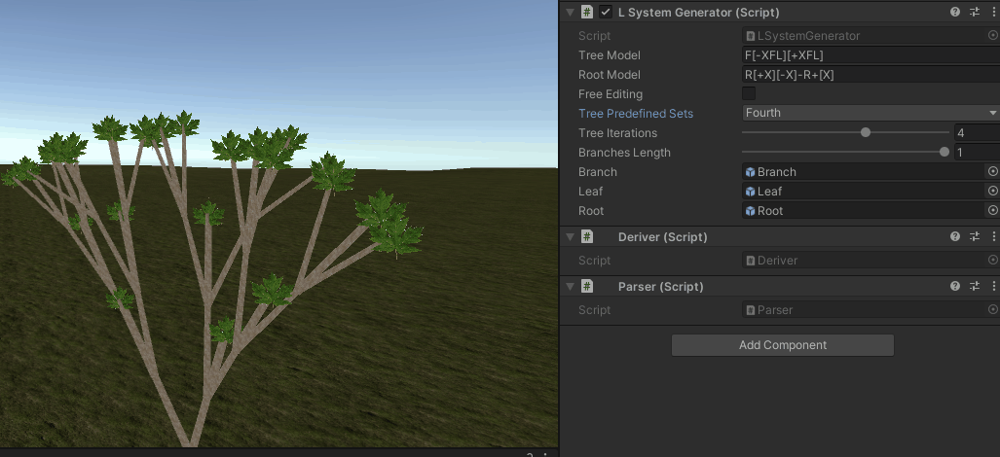

# L-system generator for trees

## About the project
This is a project for the course of A.I. for VideoGames at University of Milan, A.Y. 2021/2022.
The aim of the project is to implement a Lindenmayer system for procedural generation of tree using discrete distributions (pseudo-random integers) for enhancing the believability of the project.

### Introduction to L-systems
The Lindenmayer system were introduced and developed in 1968 (University of Utrecht) from Aristid Lindenmayer, an Hungarian theoretical biologist and botanist.
A Lindenmayer system is a parallel *rewriting system* and a type of **formal grammar**. It is composed by :
- Axiom symbol, from which to begin the construction.
- Alphabet of symbols.
- Collection of production rules that expands each symbol into a larger one (*rewriting system*).

This kind of system was used by his creator for describing the behavior of plant and cells to model the growth processes of plan development. L-system can be used also to generate self-similar *fractals*, this due to the structure of the rules that leads to **self-similarity** and thereby, fractal-like forms.

## About the tools
The development of the project was feasible thanks to the following tools :
- The project is developed on Unity 2019.4.13f1
    - As consequence the language is C#
- Microsoft Visual C++ 2019
- Git and GitHub
- Overleaf (for the drafting [report](/L_SYSTEM_AI4V_REPORT.pdf))
- ScreenToGif (gif files in `/gifs`)

## Externals
For the external assets I have created a folder called **Import**, which is placed under
the directory `Assets/Import` (it is ignored with his relative meta file).

### Assets
- [Hand Painted Grass Texture](https://assetstore.unity.com/packages/2d/textures-materials/floors/hand-painted-grass-texture-78552)
- [Bark Textures (PBR) - Volume One](https://assetstore.unity.com/packages/2d/textures-materials/nature/bark-textures-pbr-volume-one-71019)
- [Leaf.png](/Assets/Import/Leaf.png)
- [Hand Painted Seamless Wood Texture Vol - 6](https://assetstore.unity.com/packages/2d/textures-materials/wood/hand-painted-seamless-wood-texture-vol-6-162145)

## Usage
Once the project is opened in Unity, you have to open the scene in `Assets/Scenes/MainScene.unity`. After the scene is loaded you have just to click on "*Origin*" GameObject (in Hierarchy) to display the main settings available in the Inspector.

By pressing the Play button, you will be enabled to run the *MainScene* and move freely from a first person
point of view. You will be able to move your position as The in-game usable hotkeys are the following :
- The W, A, S, D keys for step into the forward, left, right and backward direction.
- With CTRL you move upward (on the positive Z axis).
- With the space bar you move downward (on the negative Z axis).
- With SHIFT you can speed up the movement into the directions.

Once the application is started, it is possible to play with the Inspector for making changes occurs on the
running application (not all the fields are editable when the game is running). If any of the following three fields are changed, a tree regeneration is triggered.

## Randomness
The application produces always a random tree using pseudo-random numbers for the orientation of branches and roots. Both the angles and the directions of the branches are chosen randomly basing the decision on a user defined *random seed* (so that it is possible to reproduce the same pseudo-random tree).

## Inspector (Origin GameObject)
Currently the inspector you see in the .gif files is outdated, there are some new functionalities that has been added, like :
* Random seed
* Roots sets

### Changing sets
There are four predefined models (or sets) to use, they are editable only if the "**Free Editing**" flag is checked, otherwise they won't change (and will be restored to the precedent model/set whenever you will click on something else).
* Now there are present also two models for the roots.

### Iterations and segment lengths
The overall tree iterations (number of derivations) and segment lengths (both branches and roots) are editable through a slider that works on the discrete interval [1,6], for the iterations, and on the continuos interval [0.01,1.0] for the branch length.

### Free Style editing
Without checking this flag is not possible to make the "real-time" editing of the predefined set.
* Now there is also the possibility to free-style edit the root set.

## Hierarchy
In the Hierarchy panel the items are organized in a tree structure way, where the origin contains the whole tree subdivided in two children between **branches** and  **roots**. This two objects respectively contains all generated branches and roots as children, with the main difference given by the fact that some of the branches got leaves, and those are children of the terminal branches.

# Bugs & Possible features
Bugs:
* Handle better the swap between the free edit and the predefined samples

Possible features:
* Add fruits
* New grammars
* Try with more than one rule
* Enables/disables the randomness.
